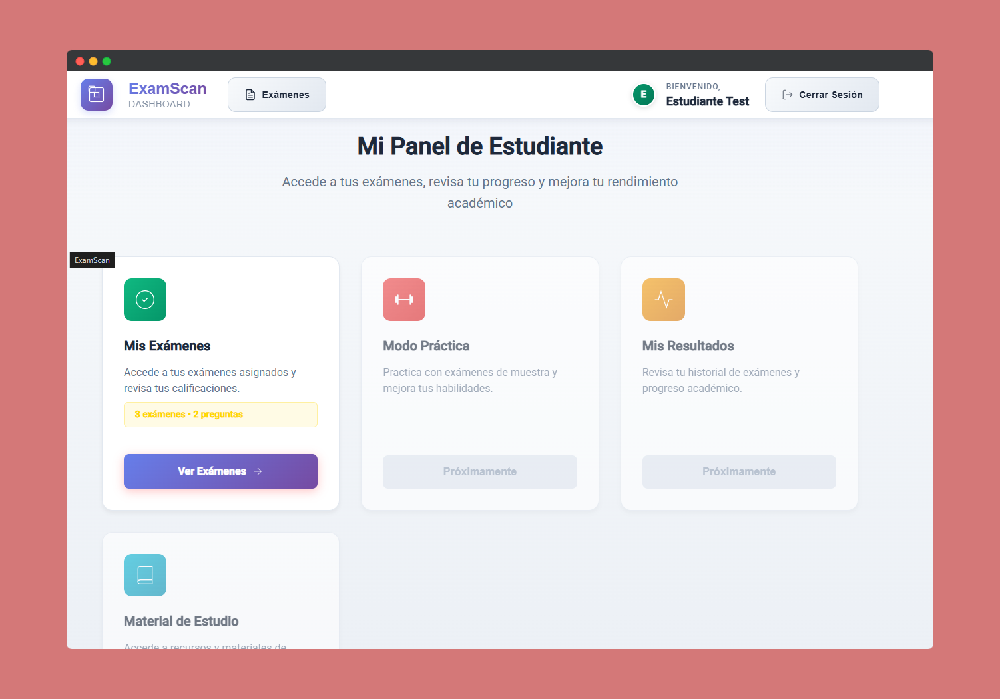

<!-- Hero Section -->
<div align="center">
  
</div>

# Exam Scan

Exam Scan es una plataforma innovadora diseñada para facilitar la creación, gestión y realización de exámenes tipo test. Utilizando inteligencia artificial y herramientas colaborativas, esta aplicación permite a los usuarios automatizar procesos, colaborar en tiempo real y analizar resultados de manera eficiente.

---

## 🚀 Características Principales

- **Subida de Exámenes**: Permite cargar archivos PDF de exámenes tipo test.
- **Extracción Automática**: Utiliza IA para extraer y estructurar preguntas automáticamente.
- **Gestión de Preguntas**: Crear, editar y organizar preguntas de forma manual o automática.
- **Colaboración**: Herramientas para revisión, comentarios y control de versiones.
- **Exámenes Interactivos**: Realización de exámenes en línea con resultados inmediatos.
- **Estadísticas y Análisis**: Consulta de estadísticas detalladas de los exámenes.

---

## 🛠️ Tecnologías Utilizadas

- **Frontend**: Angular 20+ con Angular Material para una interfaz moderna y responsiva.
- **Backend**: FastAPI y SQLModel para un backend rápido y eficiente.
- **Base de Datos**: PostgreSQL con migraciones gestionadas por Alembic.
- **Cache**: Redis para almacenamiento en caché.
- **Monitorización**: Prometheus y Grafana para métricas y visualización.
- **Contenedores**: Docker y Docker Compose para desarrollo y despliegue.

---

## 📂 Estructura del Proyecto

```text
exam_scan/
│
├── docker-compose.yml                # Orquestación de servicios para producción
├── README.md                         # Documentación general del proyecto
├── Requisitos.md                     # Documento de requisitos funcionales y técnicos
├── .devcontainer/                    # Configuración global de DevContainer (multi-servicio)
│   ├── .env.db                       # Variables de entorno para base de datos en desarrollo
│   ├── docker-compose.yml            # Compose para entorno de desarrollo global
│   ├── angular-container/            # Configuración personalizada para frontend Angular
│   └── python-container/             # Configuración personalizada para backend Python
├── backend/                          # Código fuente y configuración del backend (FastAPI)
│   ├── app/                          # Aplicación principal FastAPI
│   ├── alembic/                      # Migraciones de base de datos
│   ├── scripts/                      # Scripts auxiliares (migraciones, docker, init)
│   ├── .env                          # Variables de entorno
│   ├── alembic.ini                   # Configuración Alembic
│   ├── docker-compose.yml            # Compose para producción backend
│   ├── Dockerfile                    # Dockerfile para backend
│   ├── MIGRATIONS.md                 # Guía de migraciones
│   ├── pyproject.toml                # Dependencias Python (uv)
│   ├── pytest.ini                    # Configuración de tests
│   ├── README.md                     # Documentación backend
│   ├── steps.md                      # Pasos de implementación backend
│   ├── test_api.http                 # Pruebas HTTP manuales
│   └── uv.lock                       # Lockfile de dependencias Python
│
├── frontend/                         # Código fuente y configuración del frontend (Angular)
│   ├── src/                          # Código fuente Angular
│   ├── Dockerfile                    # Dockerfile para frontend
│   ├── angular.json                  # Configuración Angular CLI
│   └── README.md                     # Documentación frontend
│
├── grafana/                          # Configuración y dashboards de Grafana
├── prometheus/                       # Configuración de Prometheus
└── ...
```

---

## 🧑‍💻 Contribuir

¡Las contribuciones son bienvenidas! Si deseas colaborar, sigue estos pasos:

1. Haz un fork del repositorio.
2. Crea una nueva rama (`git checkout -b feature/nueva-funcionalidad`).
3. Realiza tus cambios y haz commit (`git commit -m 'Añadir nueva funcionalidad'`).
4. Sube tus cambios (`git push origin feature/nueva-funcionalidad`).
5. Abre un Pull Request.

---

## 📄 Licencia

Este proyecto está bajo la Licencia MIT. Consulta el archivo `LICENSE` para más detalles.

