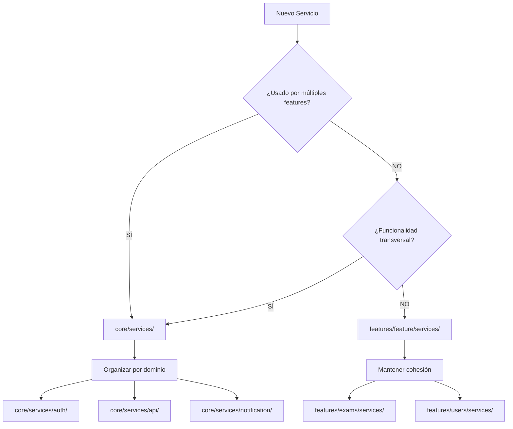

# Guía de Arquitectura: Servicios en Core vs Features

Esta guía establece las mejores prácticas para decidir dónde ubicar los servicios en la aplicación Angular, asegurando una arquitectura escalable y mantenible.

## 📋 Tabla de Contenidos

- [Principios Generales](#principios-generales)
- [Estructura Recomendada](#estructura-recomendada)
- [Criterios de Decisión](#criterios-de-decisión)
- [Ejemplos Prácticos](#ejemplos-prácticos)
- [Reglas de Implementación](#reglas-de-implementación)
- [Casos Límite](#casos-límite)
- [Migración y Refactoring](#migración-y-refactoring)

## 🎯 Principios Generales

### Core Services
Los servicios en `core/` son **transversales** y **reutilizables** a través de múltiples features.

**Características:**
- ✅ Usados por 2+ features diferentes
- ✅ Funcionalidad fundamental del sistema
- ✅ Singleton global (`providedIn: 'root'`)
- ✅ Sin dependencias a features específicas

### Feature Services
Los servicios en `features/` son **específicos** de dominio y solo se usan dentro de ese contexto.

**Características:**
- ✅ Usados exclusivamente dentro de una feature
- ✅ Lógica de negocio específica
- ✅ Pueden tener múltiples instancias
- ✅ Cohesión alta con su feature

## 🏗️ Estructura Recomendada

```
src/app/
├── core/
│   └── services/
│       ├── auth/                    # Dominio: Autenticación
│       │   ├── auth.service.ts      # ✅ Usado por múltiples features
│       │   ├── token.service.ts     # ✅ Transversal
│       │   └── index.ts             # Barrel export
│       ├── api/                     # Dominio: Comunicación HTTP
│       │   ├── api.service.ts       # ✅ Base para otros servicios
│       │   ├── error-handler.service.ts
│       │   └── index.ts
│       └── notification/            # Dominio: Notificaciones
│           ├── notification.service.ts  # ✅ Usado globalmente
│           ├── toast.service.ts
│           └── index.ts
└── features/
    ├── exams/
    │   └── services/
    │       ├── exams.service.ts     # ❌ Solo para exams feature
    │       ├── questions.service.ts
    │       └── exam-results.service.ts
    ├── users/
    │   └── services/
    │       └── users.service.ts     # ❌ Solo para users feature
    └── ai-processing/
        └── services/
            └── pdf-processor.service.ts  # ❌ Solo para AI feature
```

## 🤔 Criterios de Decisión

### Pregunta Clave
> **"¿Se usará este servicio desde 2+ features diferentes?"**

### Decision Tree



## 📝 Ejemplos Prácticos

### ✅ Core Services (Transversales)

```typescript
// ✅ core/services/auth/auth.service.ts
@Injectable({ providedIn: 'root' })
export class AuthService {
  // Usado por: dashboard, guards, interceptors, cualquier feature
}

// ✅ core/services/notification/notification.service.ts
@Injectable({ providedIn: 'root' })
export class NotificationService {
  // Usado por: auth, exams, users, dashboard, etc.
  showSuccess(message: string) { ... }
  showError(message: string) { ... }
}

// ✅ core/services/api/api.service.ts
@Injectable({ providedIn: 'root' })
export class ApiService {
  // Usado por: ExamsService, UsersService, AuthService, etc.
  get<T>(url: string): Observable<T> { ... }
  post<T>(url: string, data: any): Observable<T> { ... }
}
```

### ❌ Feature Services (Específicos)

```typescript
// ❌ features/exams/services/exams.service.ts
@Injectable({ providedIn: 'root' })
export class ExamsService {
  // Usado por: Solo desde features/exams/
  // ├── features/exams/pages/exam-list/
  // ├── features/exams/pages/exam-detail/
  // └── features/exams/components/exam-card/
}

// ❌ features/users/services/users.service.ts
@Injectable({ providedIn: 'root' })
export class UsersService {
  // Usado por: Solo desde features/users/
}

// ❌ features/ai-processing/services/pdf-processor.service.ts
@Injectable({ providedIn: 'root' })
export class PdfProcessorService {
  // Usado por: Solo desde features/ai-processing/
}
```

## 🛠️ Reglas de Implementación

### 1. Organización por Dominio en Core

```typescript
// ✅ Correcto: Agrupado por dominio
core/services/
├── auth/
│   ├── auth.service.ts
│   ├── token.service.ts
│   └── index.ts
└── api/
    ├── api.service.ts
    └── index.ts

// ❌ Incorrecto: Todos en la raíz
core/services/
├── auth.service.ts
├── token.service.ts
├── api.service.ts
└── notification.service.ts
```

### 2. Barrel Exports para Core

```typescript
// core/services/auth/index.ts
export { AuthService } from './auth.service';
export { TokenService } from './token.service';

// Uso más limpio:
import { AuthService } from '../../../../core/services/auth';
// vs
import { AuthService } from '../../../../core/services/auth/auth.service';
```

### 3. Imports Relativos en Features

```typescript
// features/exams/pages/exam-list/exam-list.ts
import { ExamsService } from '../../services/exams.service';  // ✅ Relativo
import { AuthService } from '../../../../core/services/auth';  // ✅ Core
```

## ⚠️ Casos Límite

### Servicio que Puede Cambiar de Categoría

```typescript
// Escenario: NotificationService inicialmente solo en auth
// features/auth/services/notification.service.ts

// Después se necesita en dashboard y exams
// 🔄 MIGRAR A: core/services/notification/notification.service.ts
```

### Servicio Específico con Dependencias Core

```typescript
// ✅ Correcto: Feature service que usa core services
@Injectable({ providedIn: 'root' })
export class ExamsService {
  private api = inject(ApiService);        // Core
  private auth = inject(AuthService);      // Core
  private notify = inject(NotificationService); // Core
  
  // Lógica específica de exams...
}
```

### Servicio Core que Necesita Feature Logic

```typescript
// ❌ Problemático: Core service dependiendo de feature
@Injectable({ providedIn: 'root' })
export class ApiService {
  private exams = inject(ExamsService); // ❌ Dependencia circular
}

// ✅ Solución: Inyección inversa o eventos
@Injectable({ providedIn: 'root' })
export class ApiService {
  // Features se subscriben a eventos del core service
  onApiError$ = new Subject<HttpErrorResponse>();
}
```

## 🔄 Migración y Refactoring

### Proceso de Migración Feature → Core

1. **Identificar uso transversal**
   ```bash
   # Buscar todas las importaciones
   grep -r "ExamsService" src/app/features/
   ```

2. **Crear estructura en core**
   ```bash
   mkdir -p src/app/core/services/exams
   ```

3. **Mover archivos**
   ```bash
   mv features/exams/services/exams.service.ts core/services/exams/
   mv features/exams/services/exams.service.spec.ts core/services/exams/
   ```

4. **Actualizar imports**
   ```typescript
   // Antes
   import { ExamsService } from '../../services/exams.service';
   
   // Después  
   import { ExamsService } from '../../../../core/services/exams';
   ```

5. **Crear barrel export**
   ```typescript
   // core/services/exams/index.ts
   export { ExamsService } from './exams.service';
   ```

### Proceso de Migración Core → Feature

1. **Verificar que solo se use en una feature**
2. **Mover a la feature correspondiente**
3. **Actualizar imports**
4. **Remover de core**

## 📊 Checklist de Decisión

### Para Core Services ✅

- [ ] ¿Se usa en 2+ features?
- [ ] ¿Es funcionalidad transversal?
- [ ] ¿Es fundamental para el sistema?
- [ ] ¿No tiene lógica de UI específica?
- [ ] ¿Puede ser singleton global?

### Para Feature Services ✅

- [ ] ¿Solo se usa en una feature?
- [ ] ¿Contiene lógica de dominio específica?
- [ ] ¿Está acoplado a componentes de la feature?
- [ ] ¿No se necesita globalmente?

## 🎯 Conclusión

Esta arquitectura garantiza:

- **Escalabilidad**: Fácil agregar nuevas features sin afectar core
- **Mantenibilidad**: Separación clara de responsabilidades  
- **Reutilización**: Servicios core disponibles globalmente
- **Testabilidad**: Dependencias claras y mockeables
- **Cohesión**: Lógica relacionada agrupada

### Regla de Oro

> **"Si dudas, empieza en la feature. Es más fácil migrar feature → core que core → feature"**
